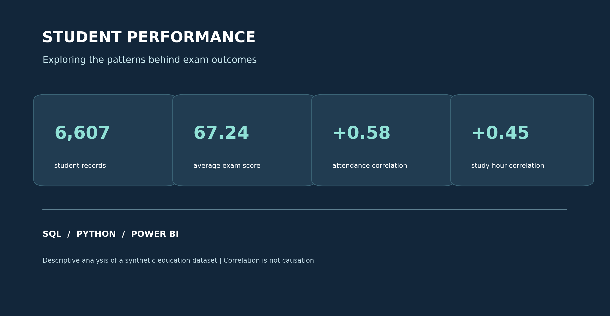
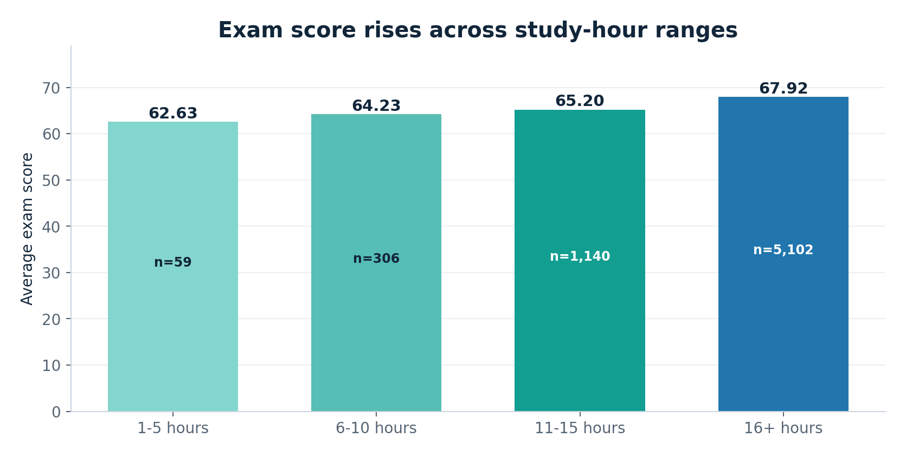
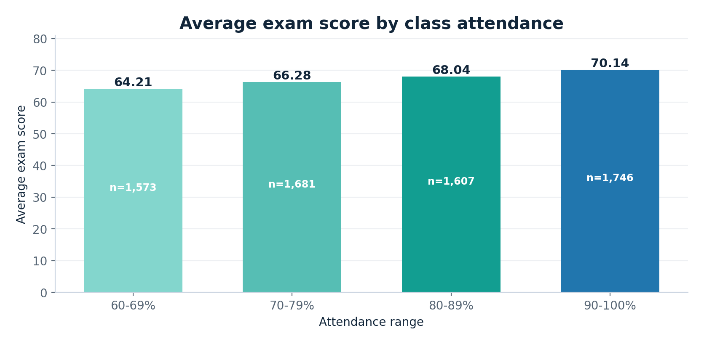
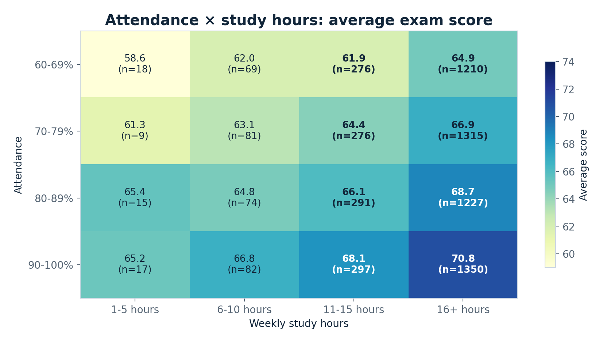
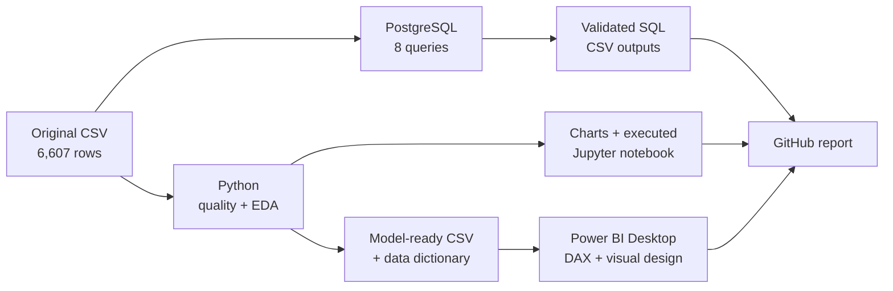

# Student Performance: What Patterns Appear Behind Exam Scores?



**An end-to-end SQL → Python → Power BI portfolio case study** based on **6,607 synthetic student records**. The project starts with three introductory SQL challenges and develops them into a reproducible analysis, a recruiter-friendly report and a ready-to-build interactive Power BI dashboard.

**Start here:** [Read the 5-page executive report](report/student_performance_executive_report.pdf) · [Browse the visual HTML report](report/portfolio_overview.html) · [Open the executed Jupyter notebook](notebooks/student_performance_analysis.ipynb) · [Build the Power BI report](powerbi/POWER_BI_BUILD_GUIDE.md)

> **Scope:** These data are synthetic and observational. The study shows descriptive patterns and correlations, **not evidence that an intervention causes a higher score**. Do not generalize the findings to actual schools.

## The 30-second summary

| Question | What the sample shows | Interpretation caveat |
|:--|:--|:--|
| Does more study time coincide with higher scores? | The 16+ weekly-hour group averages **67.92**, versus **62.63** for the 1–5-hour group. | The smallest group has only **59 records**; this is not an optimal study-hour recommendation. |
| How is attendance associated with exam score? | The 90–100% attendance group averages **70.14**, versus **64.21** for 60–69% attendance. | Students in these groups may differ in other ways. |
| What happens when attendance and study are examined together? | A 4 × 4 matrix exposes joint group patterns and the number of observations per cell. | The matrix is descriptive; it does not establish one factor compensates for another. |
| What about tutoring and sleep? | Tutoring groups have observable score differences within study-hour bands; sleep and score have **r = -0.017**. | Tutoring is not randomly assigned; near-zero linear correlation does not show sleep is unimportant. |

**Headline numerical correlations with exam score:** attendance **+0.581**, weekly study hours **+0.445**. These summarize unadjusted linear relationships.

## Visual findings

### 01 · Weekly study hours



The graph labels **both group averages and sample sizes**. Averages rise across the four predeclared bands, but the unequal group sizes limit simplistic conclusions about a specific study-hour target.

### 02 · Attendance



Students in higher attendance bands have higher mean scores in this synthetic dataset. This comparison is **unadjusted**.

### 03 · The joint attendance-and-study view



This is the project's main investigative visual: each cell shows **average score and n**. Use the sample sizes to interpret small groups cautiously. Additional charts explore [tutoring](charts/04_tutoring.png), [sleep](charts/05_sleep.png) and [numerical correlations](charts/06_correlations.png).

## The SQL challenge: original questions preserved

The three required outputs are stored under `sql/` and their executed results under `results/`:

| Original assignment | SQL file | Actual output |
|:--|:--|:--|
| More than 10 study hours **and** extracurricular activities: average by exact hours | [Q1 SQL](sql/01_avg_exam_score_by_study_and_extracurricular.sql) | [30 rows × 2 columns](results/q1_study_and_extracurricular_sql.csv) |
| Average exam score in four study-hour categories | [Q2 SQL](sql/02_avg_exam_score_by_hours_studied_range.sql) | [4 rows × 2 columns](results/q2_study_ranges_sql.csv) |
| Dense exam rankings, ties with no skipped ranks, scores hidden | [Q3 SQL](sql/03_exam_ranking.sql) | [Top 30 students × 5 columns](results/q3_top30_rank_sql.csv) |

The additional SQL questions are [attendance × study](sql/04_attendance_study_interaction.sql), [tutoring inside study bands](sql/05_tutoring_within_study_ranges.sql), [sleep groups](sql/06_sleep_hours.sql), [teacher quality including missing values](sql/07_teacher_quality.sql) and [data quality](sql/08_data_quality.sql). **PostgreSQL** is the target dialect; the lightweight local runner executes the equivalent logic using SQLite so reviewers do not need database credentials.

## How the analysis works



**Data-quality decisions:** The raw dataset contains **78 missing teacher-quality fields, 90 missing parental-education fields and 67 missing distance values**. Rather than dropping students, the model-ready extract replaces missing categorical entries with `Unknown`. One original `Exam_Score` is **101**; the coursework SQL and headline statistics **retain** that source row for exact reproducibility, while a visible flag permits sensitivity checks. The mean changes from approximately **67.2357** to **67.2305** when the flagged score is excluded.

**Optional predictive demonstration:** An 80/20 held-out split and a simple ridge baseline are provided strictly to demonstrate evaluation. Test MAE is about **1.27** for numerical variables and **1.23** after adding two categorical fields. Predictive accuracy on synthetic observations is not a causal finding or a deployable school scoring model.

## Repository map

```text
student-performance-portfolio/
├── README.md                         This portfolio landing page
├── data/                             Original Kaggle-format source CSV
├── sql/                              3 assignment + 5 advanced / QA SQL queries
├── postgres/                         psql import recipe
├── scripts/                          Reproducible generators and local SQL runner
├── notebooks/                        Executed, explained Python notebook
├── charts/                           Six clear visualizations + cover graphic
├── results/                          SQL and Python numerical outputs
├── powerbi/
│   ├── student_performance_powerbi.csv  Cleaned import-ready records
│   ├── data_dictionary.csv            Prepared-field definitions
│   ├── dax_measures.dax               Create these one at a time
│   ├── power_bi_theme.json            Power BI Desktop visual theme
│   ├── 01_power_query_optional.m      Optional explicit-type M query
│   ├── dashboard_design_mockup.png    Design concept (not an actual screenshot)
│   └── POWER_BI_BUILD_GUIDE.md        Four-page dashboard construction
├── report/                           Five-page PDF and offline HTML report
└── tests/                            Automated dataset / SQL QA
```

## Reproduce everything

Requires **Python 3.10+** and the original input already included in `data/`.

```bash
python -m pip install -r requirements.txt
python scripts/run_sql.py
python scripts/analyze.py
python scripts/build_notebook.py
python scripts/build_presentation.py
python -m unittest discover -s tests -v
```

To run against **PostgreSQL** instead of SQLite, create an empty database and execute from the repository root:

```bash
psql -d YOUR_DATABASE -f sql/00_schema.sql
psql -d YOUR_DATABASE -f postgres/01_import_with_psql.sql
psql -d YOUR_DATABASE -f sql/01_avg_exam_score_by_study_and_extracurricular.sql
```

Then run other SQL files as required. The `CAST(... AS NUMERIC)` or PostgreSQL `::NUMERIC` conversion allows `ROUND(AVG(...), 2)` even when a deployed table uses floating-point `exam_score`.

## Dataset provenance and limits

- **Source:** [Student Performance Factors — Lai Nguyen, Kaggle](https://www.kaggle.com/datasets/lainguyn123/student-performance-factors). The provided CSV matches this public dataset's published schema and 6,607-row count. External research describes the source as **synthetic** and **CC0**, but verify current Kaggle licensing if republishing or redistributing the dataset.
- **Grain:** one source row = one synthetic student record. No genuine student ID or time dimension exists; the prepared `Student_ID` is simply the original row number, not an identifier for real people.
- **Limitations:** observational group differences are susceptible to overlapping factors and group-size imbalance; numerical correlation does not establish direct influence. One out-of-range score is retained, flagged and quantified.
- **Portfolio intent:** educational analytics practice, **not** claims about how real students or schools should be evaluated.

**Microsoft reference:** [Power BI Desktop measures and calculations](https://learn.microsoft.com/en-us/power-bi/transform-model/desktop-calculations-options).
